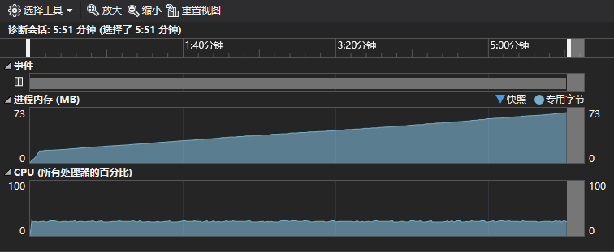

# YogaTree

This is a voxel read and write project.

## Dependencies

- libtiff 4.0.7
- googletest
- zlib

## Test

Using googletest in your visusal studio project, the googletest needed and **Test Adapter for Google Test** needed for using unit test.

1. **Make sure you have provide the proper test tiff image path to the `readTif` function in test.cpp**
1. Run the **Sample-Test1**

## TODO

- [ ] Add multiple tiff value type
  - [x] uint8
- [ ] Add visualization
- [ ] Add SiblingPtr support
- [ ] Add Tbb acceleration
- [ ] Add Code Samples

## Performance

